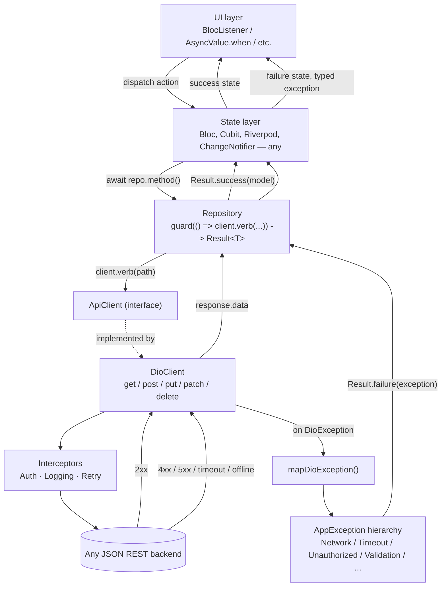

# Network & Error-Handling Standard

A drop-in reference for the API/error layer of any Flutter app, over any JSON REST backend. Copy the files in Section 3 into a new project as-is; nothing in them names a specific backend, endpoint, or domain model. The only files you write per-project are your endpoint list, your domain models, and — if your backend's error shape differs from the common ones already handled — one function.

This is not a survey of options. It is one opinionated, complete implementation, with the reasoning for each decision inline as comments in the code, so picking it up in a fresh session doesn't require re-deriving the "why."

## 1. The shape of it

Six layers. Requests flow down, failures flow up, and there is exactly one point where a transport-level error becomes a typed, application-level one.



**Scope note:** this assumes a JSON REST backend, which covers the large majority of mobile integrations. Talking to GraphQL or gRPC changes the client and message-extraction layers; the exception hierarchy and `Result` type underneath are transport-agnostic and still apply as-is.

## 2. The six rules

Everything in Section 3 exists to make these six things true by construction, not by convention that erodes as a codebase grows past one author:

1. **A repository method either returns data or a typed reason — never a bare `null`/`false` standing in for "it failed."** Every repository method returns `Result<T>`, built with `guard()`. There's no second, silent failure channel to remember to check.
2. **No caught exception is ever shown to a user via `.toString()`.** `AppException` overrides `toString()` once, in the base class — every subtype inherits a correct message for free, so even a lazy `Text(exception.toString())` is safe.
3. **The exception mapper has no partial branches.** Every `DioExceptionType` and every HTTP status bucket is handled, including an explicit `default`. An unrecognized status code becomes `UnknownException(statusCode: ...)`, never a value that silently resolves to `null` three layers up.
4. **All five HTTP verbs fail the same way.** `get`, `post`, `put`, `patch`, `delete` all route through one internal `_run()` helper — there's no verb where error-mapping was forgotten because it was added later.
5. **Backend-specific error parsing lives in exactly one function.** `extractErrorMessage` is the single seam you replace when you point this layer at a different backend's error shape. No repository ever reaches into a response body itself.
6. **Failures are typed, not just worded.** `UnauthorizedException`, `ValidationException`, `ServerErrorException`, etc. are distinguishable with `is`/`switch`, so the app can react differently — force logout, highlight a form field, show a generic banner — without parsing message strings.

## 3. The files

Drop these under `lib/core/network/`. Nothing here imports Bloc, Riverpod, or any state-management package — this layer only ever produces `Result<T>` and `AppException`; what a feature does with them is Section 4.

```
lib/core/network/
├── api_client.dart
├── dio_client.dart
├── result.dart
├── exceptions/
│   ├── app_exception.dart
│   └── exception_mapper.dart
└── interceptors/
    ├── auth_interceptor.dart
    ├── logging_interceptor.dart
    └── retry_interceptor.dart      (optional, see §6)
```

Dependency: `dio: ^5.x`. Requires Dart ≥ 3.0 (sealed classes + pattern matching).

### `api_client.dart`

```dart
/// Abstract transport boundary. Repositories depend on this, never on
/// the underlying HTTP client directly — that's what makes repositories
/// testable with a fake, and what lets you swap Dio for something else
/// later without touching a single feature.
abstract class ApiClient {
  Future<dynamic> get(
    String path, {
    Map<String, dynamic>? queryParameters,
    Map<String, dynamic>? headers,
  });

  Future<dynamic> post(
    String path, {
    Object? data,
    Map<String, dynamic>? queryParameters,
    Map<String, dynamic>? headers,
    bool isFormData = false,
  });

  Future<dynamic> put(
    String path, {
    Object? data,
    Map<String, dynamic>? queryParameters,
    Map<String, dynamic>? headers,
    bool isFormData = false,
  });

  Future<dynamic> patch(
    String path, {
    Object? data,
    Map<String, dynamic>? queryParameters,
    Map<String, dynamic>? headers,
    bool isFormData = false,
  });

  Future<dynamic> delete(
    String path, {
    Object? data,
    Map<String, dynamic>? queryParameters,
    Map<String, dynamic>? headers,
  });
}
```

### `exceptions/app_exception.dart`

```dart
/// Every failure that crosses the ApiClient boundary becomes one of these.
/// Nothing above this layer should ever need to inspect a DioException,
/// an HTTP status code, or a raw SocketException directly. `sealed` means
/// the compiler forces exhaustive handling anywhere this is switched on.
sealed class AppException implements Exception {
  final String message;
  final int? statusCode;
  final Object? cause;

  const AppException(this.message, {this.statusCode, this.cause});

  /// Overridden once, here. Every subtype gets a correct toString() for
  /// free — `Text(exception.toString())` is always safe to write.
  @override
  String toString() => message;
}

/// No response reached the device at all: airplane mode, DNS failure,
/// dropped connection mid-request.
final class NetworkException extends AppException {
  const NetworkException([
    super.message = 'No internet connection. Check your network and try again.',
  ]);
}

/// The request or response took too long.
final class TimeoutException extends AppException {
  const TimeoutException([
    super.message = 'The request timed out. Please try again.',
  ]);
}

/// The request was cancelled — e.g. the user navigated away before it
/// finished. Usually safe to ignore silently in the UI.
final class CancelledException extends AppException {
  const CancelledException([super.message = 'Request cancelled.']);
}

/// 400 — malformed request.
final class BadRequestException extends AppException {
  const BadRequestException(super.message, {super.statusCode});
}

/// 401 — missing, expired, or invalid credentials. Kept as its own type
/// (not folded into a generic 4xx) specifically so the app can react
/// globally — force logout — without string-matching a message.
final class UnauthorizedException extends AppException {
  const UnauthorizedException(super.message, {super.statusCode});
}

/// 403 — authenticated, but not allowed to do this.
final class ForbiddenException extends AppException {
  const ForbiddenException(super.message, {super.statusCode});
}

/// 404 — resource doesn't exist.
final class NotFoundException extends AppException {
  const NotFoundException(super.message, {super.statusCode});
}

/// 409 — conflicting state (duplicate entry, stale write, etc).
final class ConflictException extends AppException {
  const ConflictException(super.message, {super.statusCode});
}

/// 422 — validation failure. Carries per-field errors when the backend
/// supplies them, so a form can highlight the offending field instead of
/// showing one generic message for every kind of bad input.
final class ValidationException extends AppException {
  final Map<String, List<String>> fieldErrors;
  const ValidationException(
    super.message, {
    this.fieldErrors = const {},
    super.statusCode,
  });
}

/// 5xx — the backend is broken, not the request.
final class ServerErrorException extends AppException {
  const ServerErrorException(super.message, {super.statusCode});
}

/// Anything else: a status code with no explicit case, an unparseable
/// body, a platform exception that isn't even a DioException. Always
/// constructed with the best message available — this is the type that
/// replaces "falls through and returns null."
final class UnknownException extends AppException {
  const UnknownException(super.message, {super.statusCode, super.cause});
}
```

### `exceptions/exception_mapper.dart`

```dart
import 'dart:io';
import 'package:dio/dio.dart';
import 'app_exception.dart';

/// Backend-specific: given a decoded error response body, pull out a
/// human-readable message, or return null if this parser doesn't
/// recognize the shape. This is the one seam you replace per backend —
/// see the default implementation below for the shapes it already covers.
typedef ErrorMessageExtractor = String? Function(dynamic responseData);

/// The one chokepoint: every DioException in the app passes through here
/// exactly once (inside DioClient) and comes out as an [AppException].
/// No other code should call this directly.
AppException mapDioException(
  DioException error, {
  ErrorMessageExtractor extractMessage = defaultExtractErrorMessage,
}) {
  final response = error.response;
  final statusCode = response?.statusCode;
  final extracted = response != null ? extractMessage(response.data) : null;

  switch (error.type) {
    case DioExceptionType.connectionTimeout:
    case DioExceptionType.sendTimeout:
    case DioExceptionType.receiveTimeout:
      return TimeoutException(extracted ?? const TimeoutException().message);

    case DioExceptionType.connectionError:
      return NetworkException(extracted ?? const NetworkException().message);

    case DioExceptionType.cancel:
      return CancelledException(extracted ?? const CancelledException().message);

    case DioExceptionType.badCertificate:
      return NetworkException(
        extracted ?? "Could not verify the server's security certificate.",
      );

    case DioExceptionType.badResponse:
      return _mapStatusCode(statusCode, extracted);

    case DioExceptionType.unknown:
      // DioExceptionType.unknown wraps platform-level failures Dio didn't
      // classify itself — a dropped socket is the most common cause.
      if (error.error is SocketException) {
        return NetworkException(extracted ?? const NetworkException().message);
      }
      return UnknownException(
        extracted ?? error.message ?? 'Something went wrong. Please try again.',
        cause: error.error,
      );
  }
}

AppException _mapStatusCode(int? statusCode, String? message) {
  final fallback =
      message ?? 'Request failed${statusCode != null ? ' ($statusCode)' : ''}.';
  switch (statusCode) {
    case 400:
      return BadRequestException(fallback, statusCode: statusCode);
    case 401:
      return UnauthorizedException(
        message ?? 'Your session has expired. Please sign in again.',
        statusCode: statusCode,
      );
    case 403:
      return ForbiddenException(
        message ?? "You don't have permission to do that.",
        statusCode: statusCode,
      );
    case 404:
      return NotFoundException(message ?? 'Not found.', statusCode: statusCode);
    case 409:
      return ConflictException(fallback, statusCode: statusCode);
    case 422:
      return ValidationException(
        message ?? 'Please check the form and try again.',
        statusCode: statusCode,
      );
    case 500:
    case 502:
    case 503:
    case 504:
      return ServerErrorException(
        message ?? 'The server ran into a problem. Please try again shortly.',
        statusCode: statusCode,
      );
    default:
      // Deliberately not omitted: any status this switch doesn't name
      // yet still becomes a well-formed exception instead of falling
      // through to a null return.
      return UnknownException(fallback, statusCode: statusCode);
  }
}

/// Default parser: tries the response shapes seen most often across REST
/// APIs, in order, before giving up. Override by passing your own
/// [ErrorMessageExtractor] into [DioClient] — that's the only thing that
/// changes when you point this layer at a different backend.
String? defaultExtractErrorMessage(dynamic data) {
  if (data == null) return null;
  if (data is String && data.trim().isNotEmpty) return data;

  if (data is Map) {
    // { "message": "..." }                 — Laravel, most hand-rolled REST APIs
    final message = data['message'];
    if (message is String && message.isNotEmpty) return message;

    // { "error": "..." } or { "error": { "message": "..." } }
    final error = data['error'];
    if (error is String && error.isNotEmpty) return error;
    if (error is Map && error['message'] is String) {
      return error['message'] as String;
    }

    // { "detail": "..." }                   — Django REST Framework
    final detail = data['detail'];
    if (detail is String && detail.isNotEmpty) return detail;

    // { "title": "..." }                    — RFC 7807 problem+json
    final title = data['title'];
    if (title is String && title.isNotEmpty) return title;

    // { "errors": { "email": ["..."] } }    — Laravel-style validation
    final errors = data['errors'];
    if (errors is Map) {
      for (final value in errors.values) {
        if (value is List && value.isNotEmpty && value.first is String) {
          return value.first as String;
        }
      }
    }
    // { "errors": ["..."] }
    if (errors is List && errors.isNotEmpty && errors.first is String) {
      return errors.first as String;
    }
  }
  return null;
}

/// Extracts per-field validation errors from the common
/// `{ "errors": { "field": ["msg1", "msg2"] } }` shape, for
/// [ValidationException.fieldErrors]. Pair with a custom
/// [defaultExtractErrorMessage] override if your backend shapes 422s
/// differently.
Map<String, List<String>> extractFieldErrors(dynamic data) {
  if (data is! Map) return const {};
  final errors = data['errors'];
  if (errors is! Map) return const {};
  return errors.map(
    (key, value) => MapEntry(
      key.toString(),
      value is List ? value.map((e) => e.toString()).toList() : [value.toString()],
    ),
  );
}
```

> Wire `extractFieldErrors` into `_mapStatusCode`'s `case 422` if you need field-level errors — it's kept as a separate function above so a project that never renders per-field validation UI doesn't pay for it.

### `result.dart`

```dart
import 'exceptions/app_exception.dart';

/// The return type for every repository method that can fail. Replaces
/// the common but ambiguous pattern of throwing for some failures and
/// returning null/false for others — a repository either produces data
/// or a typed reason, and callers can't forget to check which.
sealed class Result<T> {
  const Result();

  const factory Result.success(T data) = Success<T>;
  const factory Result.failure(AppException exception) = Failure<T>;

  bool get isSuccess => this is Success<T>;
  bool get isFailure => this is Failure<T>;

  /// Collapse both branches into one value — typically a UI state.
  R fold<R>(
    R Function(T data) onSuccess,
    R Function(AppException exception) onFailure,
  ) {
    return switch (this) {
      Success<T>(data: final data) => onSuccess(data),
      Failure<T>(exception: final exception) => onFailure(exception),
    };
  }

  /// Transform the success value without unwrapping the Result.
  Result<R> map<R>(R Function(T data) transform) {
    return switch (this) {
      Success<T>(data: final data) => Result.success(transform(data)),
      Failure<T>(exception: final exception) => Result.failure(exception),
    };
  }
}

final class Success<T> extends Result<T> {
  final T data;
  const Success(this.data);
}

final class Failure<T> extends Result<T> {
  final AppException exception;
  const Failure(this.exception);
}

/// Runs [action] and converts any thrown [AppException] — or any other
/// exception, wrapped as [UnknownException] — into a [Result]. Repository
/// methods call their ApiClient inside this instead of hand-writing
/// try/catch, which is what keeps rule 1 (§2) true everywhere at once.
Future<Result<T>> guard<T>(Future<T> Function() action) async {
  try {
    return Result.success(await action());
  } on AppException catch (e) {
    return Result.failure(e);
  } catch (e) {
    // Anything that reaches here is a bug or an unmapped edge case
    // (e.g. a JSON-decoding error on a malformed 200 response) rather
    // than an expected API failure — still surfaced as a Result, not a
    // crash, but worth logging loudly via your project's logger.
    return Result.failure(
      UnknownException('Something went wrong. Please try again.', cause: e),
    );
  }
}
```

`Result` is the recommended default, but it's optional sugar on top of the exception hierarchy — see the note at the end of Section 4 if a codebase prefers plain `try`/`catch on AppException` instead.

### `dio_client.dart`

```dart
import 'package:dio/dio.dart';
import 'api_client.dart';
import 'exceptions/exception_mapper.dart';

/// Dio-based implementation of [ApiClient]. Every verb routes through
/// [_run], so error-mapping can't be forgotten on one verb while present
/// on the others (rule 4, §2) — there is only one place it's written.
class DioClient implements ApiClient {
  final Dio dio;
  final ErrorMessageExtractor extractErrorMessage;

  DioClient({
    required this.dio,
    required String baseUrl,
    List<Interceptor> interceptors = const [],
    this.extractErrorMessage = defaultExtractErrorMessage,
    Duration connectTimeout = const Duration(seconds: 15),
    Duration receiveTimeout = const Duration(seconds: 15),
  }) {
    dio.options.baseUrl = baseUrl;
    dio.options.connectTimeout = connectTimeout;
    dio.options.receiveTimeout = receiveTimeout;
    dio.interceptors.addAll(interceptors);
  }

  Future<dynamic> _run(Future<Response<dynamic>> Function() call) async {
    try {
      final response = await call();
      return response.data;
    } on DioException catch (e) {
      throw mapDioException(e, extractMessage: extractErrorMessage);
    }
  }

  Options? _options(Map<String, dynamic>? headers) =>
      headers != null ? Options(headers: headers) : null;

  Object? _body(Object? data, bool isFormData) =>
      isFormData && data is Map ? FormData.fromMap(data.cast<String, dynamic>()) : data;

  @override
  Future<dynamic> get(
    String path, {
    Map<String, dynamic>? queryParameters,
    Map<String, dynamic>? headers,
  }) =>
      _run(() => dio.get(path,
          queryParameters: queryParameters, options: _options(headers)));

  @override
  Future<dynamic> post(
    String path, {
    Object? data,
    Map<String, dynamic>? queryParameters,
    Map<String, dynamic>? headers,
    bool isFormData = false,
  }) =>
      _run(() => dio.post(path,
          data: _body(data, isFormData),
          queryParameters: queryParameters,
          options: _options(headers)));

  @override
  Future<dynamic> put(
    String path, {
    Object? data,
    Map<String, dynamic>? queryParameters,
    Map<String, dynamic>? headers,
    bool isFormData = false,
  }) =>
      _run(() => dio.put(path,
          data: _body(data, isFormData),
          queryParameters: queryParameters,
          options: _options(headers)));

  @override
  Future<dynamic> patch(
    String path, {
    Object? data,
    Map<String, dynamic>? queryParameters,
    Map<String, dynamic>? headers,
    bool isFormData = false,
  }) =>
      _run(() => dio.patch(path,
          data: _body(data, isFormData),
          queryParameters: queryParameters,
          options: _options(headers)));

  @override
  Future<dynamic> delete(
    String path, {
    Object? data,
    Map<String, dynamic>? queryParameters,
    Map<String, dynamic>? headers,
  }) =>
      _run(() => dio.delete(path,
          data: data, queryParameters: queryParameters, options: _options(headers)));
}
```

### `interceptors/auth_interceptor.dart`

```dart
import 'package:dio/dio.dart';

typedef TokenProvider = Future<String?> Function();
typedef UnauthorizedHandler = Future<void> Function();

/// Attaches a bearer token to every outgoing request via an injected
/// [TokenProvider] — deliberately not coupled to SharedPreferences, secure
/// storage, or any specific auth package, so this file is identical
/// across projects regardless of where the token actually lives.
///
/// Optionally reacts to a global 401 by invoking [onUnauthorized] once
/// (e.g. clear the session and route to login) instead of leaving every
/// feature to notice and handle a 401 independently.
class AuthInterceptor extends Interceptor {
  final TokenProvider getToken;
  final UnauthorizedHandler? onUnauthorized;

  AuthInterceptor({required this.getToken, this.onUnauthorized});

  @override
  void onRequest(RequestOptions options, RequestInterceptorHandler handler) async {
    final token = await getToken();
    if (token != null && token.isNotEmpty) {
      options.headers['Authorization'] = 'Bearer $token';
    }
    options.headers['Accept'] = 'application/json';
    handler.next(options);
  }

  @override
  void onError(DioException err, ErrorInterceptorHandler handler) {
    if (err.response?.statusCode == 401) {
      onUnauthorized?.call();
    }
    handler.next(err);
  }
}
```

### `interceptors/logging_interceptor.dart`

```dart
import 'package:dio/dio.dart';

/// Thin wrapper around Dio's LogInterceptor so logging can be switched
/// off in release builds from the construction site
/// (`LoggingInterceptor(enabled: kDebugMode)`) instead of conditionally
/// adding/removing the interceptor elsewhere.
class LoggingInterceptor extends LogInterceptor {
  LoggingInterceptor({bool enabled = true})
      : super(
          request: enabled,
          requestHeader: enabled,
          requestBody: enabled,
          responseHeader: false,
          responseBody: enabled,
          error: enabled,
        );
}
```

## 4. Using it in a feature

### Repository

```dart
class AuthRepository {
  final ApiClient _client;
  AuthRepository(this._client);

  Future<Result<User>> signIn({required String email, required String password}) {
    return guard(() async {
      final json = await _client.post('/auth/login', data: {
        'email': email,
        'password': password,
      });
      return User.fromJson(json['user'] as Map<String, dynamic>);
    });
  }
}
```

Nothing here catches anything — `guard` already turned every failure mode into `Result.failure(AppException)`. The repository's only job is shaping the JSON into a domain model.

### State layer — Bloc/Cubit

```dart
sealed class SignInState {}
final class SignInInitial extends SignInState {}
final class SignInLoading extends SignInState {}
final class SignInSuccess extends SignInState {
  final User user;
  SignInSuccess(this.user);
}
final class SignInFailed extends SignInState {
  final AppException exception;
  SignInFailed(this.exception);
  String get message => exception.message;
}

class SignInBloc extends Bloc<SignInEvent, SignInState> {
  final AuthRepository _repository;
  SignInBloc(this._repository) : super(SignInInitial()) {
    on<SignInSubmitted>((event, emit) async {
      emit(SignInLoading());
      final result = await _repository.signIn(email: event.email, password: event.password);
      emit(switch (result) {
        Success(data: final user) => SignInSuccess(user),
        Failure(exception: final e) => SignInFailed(e),
      });
    });
  }
}
```

No `try`/`catch` in the bloc at all — `Result` already forced both branches to be handled, and the compiler enforces it (the `switch` is exhaustive over a sealed type).

### State layer — Riverpod (same repository, different glue)

```dart
final signInProvider = FutureProvider.autoDispose
    .family<User, ({String email, String password})>((ref, args) async {
  final result = await ref
      .read(authRepositoryProvider)
      .signIn(email: args.email, password: args.password);
  return result.fold((user) => user, (exception) => throw exception);
});

// consumed as AsyncValue<User>:
// .when(
//   data: (user) => ...,
//   error: (e, _) => Text((e as AppException).message),
//   loading: () => const CircularProgressIndicator(),
// )
```

The repository and network layer don't change between the two examples — only how the last `Result` gets turned into framework-specific state does. That's the point of keeping `Result`/`AppException` free of any state-management import.

### UI layer

```dart
BlocListener<SignInBloc, SignInState>(
  listener: (context, state) {
    if (state is SignInFailed) {
      if (state.exception is UnauthorizedException) {
        return; // handled globally by the session listener below
      }
      ScaffoldMessenger.of(context).showSnackBar(
        SnackBar(content: Text(state.message)),
      );
    }
  },
  child: ...,
)
```

### Global 401 handling

```dart
class SessionController {
  final _unauthorized = StreamController<void>.broadcast();
  Stream<void> get onUnauthorized => _unauthorized.stream;

  Future<void> forceLogout() async {
    await TokenStorage.clear();
    _unauthorized.add(null);
  }
}

final session = SessionController();
final dioClient = DioClient(
  dio: Dio(),
  baseUrl: ApiConfig.baseUrl,
  interceptors: [
    AuthInterceptor(getToken: TokenStorage.read, onUnauthorized: session.forceLogout),
    LoggingInterceptor(enabled: kDebugMode),
  ],
);

// once, near the app root:
session.onUnauthorized.listen((_) {
  navigatorKey.currentState?.pushNamedAndRemoveUntil('/login', (_) => false);
});
```

A 401 anywhere in the app now ends the session once, in one listener — no feature needs to special-case it, and `UnauthorizedException` still reaches the bloc/state layer normally in case a screen wants to react locally too (as in the `BlocListener` above).

### Testing

The interface boundary is what makes this cheap to test without a real server:

```dart
class FakeApiClient implements ApiClient {
  Future<dynamic> Function(String path, Object? data)? onPost;

  @override
  Future<dynamic> post(String path, {Object? data, queryParameters, headers, isFormData = false}) {
    return onPost?.call(path, data) ?? Future.value(null);
  }
  // ...implement the remaining verbs the same way, throwing UnimplementedError
  // for the ones a given test doesn't need.
}

test('signIn surfaces UnauthorizedException as a typed Failure', () async {
  final client = FakeApiClient()
    ..onPost = (_, __) async => throw const UnauthorizedException('Invalid credentials');
  final repository = AuthRepository(client);

  final result = await repository.signIn(email: 'a@b.com', password: 'wrong');

  expect(result, isA<Failure<User>>());
  expect((result as Failure<User>).exception, isA<UnauthorizedException>());
});
```

No Dio, no mock HTTP server, no widget pump — the repository test is a pure function test because `ApiClient` is an interface.

### If you don't want `Result`

The exception hierarchy and mapper are the load-bearing part of this design; `Result` is a convenience on top. A codebase that prefers plain exceptions can skip `result.dart` entirely — repositories just `return User.fromJson(...)` and let `AppException` propagate, and blocs do:

```dart
try {
  final user = await _repository.signIn(event.email, event.password);
  emit(SignInSuccess(user));
} on AppException catch (e) {
  emit(SignInFailed(e));
}
```

Rules 2, 3, 4, 5, and 6 from Section 2 still hold either way — only rule 1 (no bare `try`/`catch` per call site) is specific to using `Result`.

## 5. Adapting `extractErrorMessage` to a new backend

This is the only function you should ever need to touch when pointing this layer at a different API. Two examples:

```dart
// A backend that returns { "success": false, "errorText": "..." }
String? myBackendExtractor(dynamic data) {
  if (data is Map && data['errorText'] is String) return data['errorText'] as String;
  return defaultExtractErrorMessage(data); // fall back to the common shapes
}

final client = DioClient(
  dio: Dio(),
  baseUrl: ApiConfig.baseUrl,
  extractErrorMessage: myBackendExtractor,
);
```

```dart
// A backend that returns a flat array of error strings: ["Email is required"]
String? arrayShapeExtractor(dynamic data) {
  if (data is List && data.isNotEmpty && data.first is String) return data.first as String;
  return defaultExtractErrorMessage(data);
}
```

Everything downstream — `AppException` types, `Result`, blocs, UI — is unaffected by which backend you're pointed at.

## 6. Optional hardening

Add these only when a project actually needs them — they're not part of the baseline six rules, but they close gaps that show up as apps grow.

**Retry on transient network failure** (`interceptors/retry_interceptor.dart`) — retries idempotent requests (`GET` by default) with exponential backoff when they fail due to a timeout or dropped connection, the class of failure that's often transient on mobile networks. Never retries `POST`/`PATCH`/`DELETE` by default, since those aren't safe to repeat blindly unless the backend guarantees idempotency (e.g. via an idempotency key).

```dart
import 'dart:async';
import 'package:dio/dio.dart';

class RetryInterceptor extends Interceptor {
  final Dio dio;
  final int maxRetries;
  final Duration baseDelay;
  final Set<String> retryableMethods;

  RetryInterceptor({
    required this.dio,
    this.maxRetries = 2,
    this.baseDelay = const Duration(milliseconds: 500),
    this.retryableMethods = const {'GET'},
  });

  @override
  void onError(DioException err, ErrorInterceptorHandler handler) async {
    final method = err.requestOptions.method.toUpperCase();
    final isTransient = err.type == DioExceptionType.connectionTimeout ||
        err.type == DioExceptionType.receiveTimeout ||
        err.type == DioExceptionType.connectionError;
    final attempt = (err.requestOptions.extra['retry_attempt'] as int?) ?? 0;

    if (isTransient && retryableMethods.contains(method) && attempt < maxRetries) {
      final nextAttempt = attempt + 1;
      await Future.delayed(baseDelay * nextAttempt);
      try {
        final options = err.requestOptions..extra['retry_attempt'] = nextAttempt;
        final response = await dio.fetch(options);
        return handler.resolve(response);
      } catch (_) {
        // fall through and propagate the original error
      }
    }
    handler.next(err);
  }
}
```

**Token refresh instead of hard logout on 401** — swap `AuthInterceptor`'s `onUnauthorized` from "log out" to "refresh the token, then replay the original request once." Needs a mutex/queue so concurrent 401s don't each trigger their own refresh; out of scope for the baseline here because it's meaningfully more state to manage correctly, but the seam for it is `AuthInterceptor.onError`.

**Structured logging instead of `print`** — inject a logger interface (`void Function(String message, {Object? error})`) into `LoggingInterceptor` and `guard`'s catch-all branch, so production builds can route failures to Crashlytics/Sentry instead of `print`, without touching call sites.

## 7. Setup checklist for a new project

1. Add `dio` to `pubspec.yaml`.
2. Copy the files from Section 3 into `lib/core/network/` unmodified.
3. Write `lib/core/config/api_config.dart` with your `baseUrl` (and any other per-environment values) — the only truly project-specific file besides your endpoint list.
4. Write your endpoint list (a simple class of string constants/functions, one per route) — not part of this layer by design, since endpoints are inherently project-specific.
5. If your backend's error body doesn't match one of the shapes `defaultExtractErrorMessage` already handles, write one override function (Section 5) and pass it into `DioClient`.
6. Wire it up once, near app start: `Dio()` → `DioClient(dio: ..., baseUrl: ..., interceptors: [AuthInterceptor(...), LoggingInterceptor(enabled: kDebugMode)])` → inject into repositories → inject repositories into your state layer via whatever DI you're using.
7. Add `SessionController` (or equivalent) and wire `AuthInterceptor.onUnauthorized` to it if the app needs a global "session expired" behavior.
8. Write repositories returning `Result<T>` via `guard()`. Never catch inside a repository just to log-and-swallow — let `guard` do the catching.
9. Write state classes so every `Failure` case carries the `AppException`, not just a pre-formatted string — UI can then special-case by type where it matters and fall back to `exception.message` everywhere else.
10. Add `RetryInterceptor` only if the app has shown a real need for it (Section 6) — don't add it speculatively.
